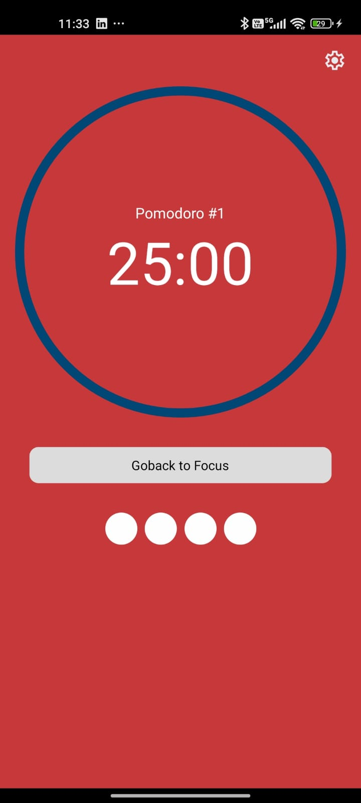
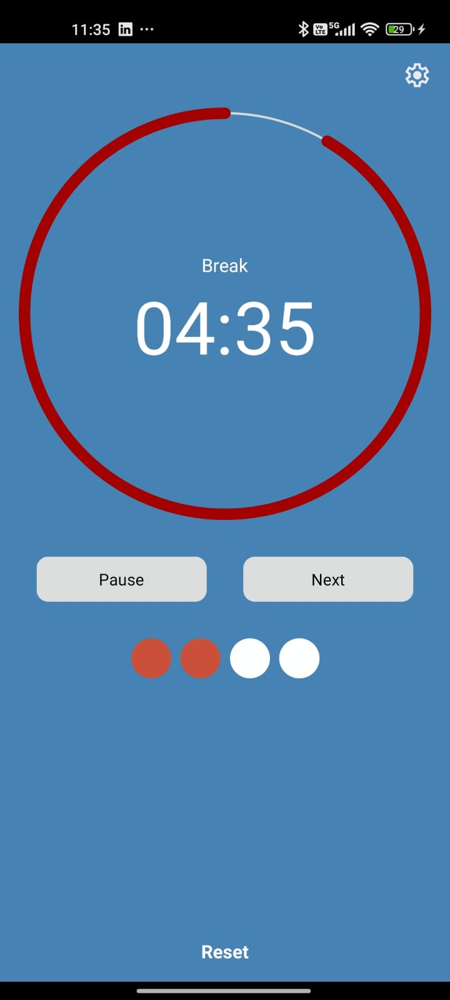
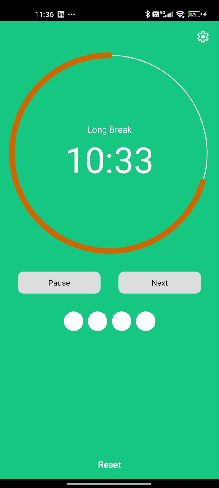
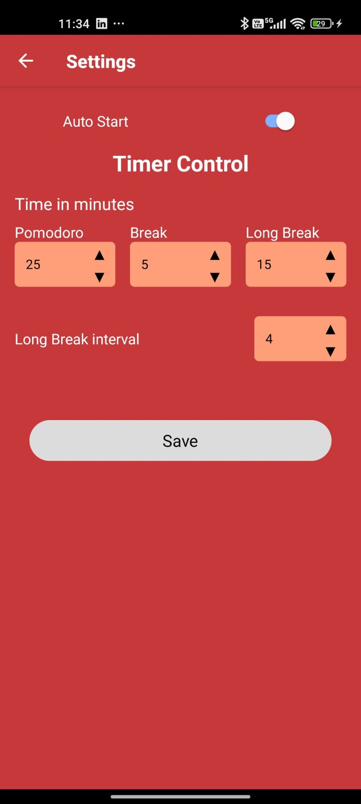

# ⏳ Cycle Focus - Pomodoro Timer 🍅

Descrição:
Cycle Focus é o app perfeito para melhorar sua produtividade usando a famosa Técnica Pomodoro! 🎯 Organize seus ciclos de trabalho e pausas de maneira simples e eficaz, promovendo foco e equilíbrio no seu dia a dia. 💡

✨ Funcionalidades Principais:

⏱️ Temporizador ajustável para sessões de trabalho e descanso.
📊 Relatórios de produtividade para acompanhar seu progresso.
🖌️ Interface intuitiva e fácil de usar, ideal para qualquer rotina.
📥 Instalação:

Baixe agora pela Google Play Store: [Cycle Focus - Pomodoro Timer](https://play.google.com/store/apps/details?id=com.cyclefocuspomo)

Configure seus tempos de trabalho e pausa e comece a focar no que importa! 🚀
👥 Para quem é?
Estudantes, profissionais ou qualquer pessoa que deseja dominar a gestão de tempo e alcançar seus objetivos com mais eficiência. 💪

📌 Status do Projeto:
Ativo e disponível para download.

## Tecnologias :rocket:

- [x] React Native
- [x] TypeScript
- [x] Navigation
- [x] Redux Toolkit e Redux Persist
- [x] background action
- [x] Notificações
- [ ] Testes unitários

### Screenshot

- ## Tela inicial

  

- ## Pausa

  

- ## Longa Pausa

  

- ## Configuraçoes

  
